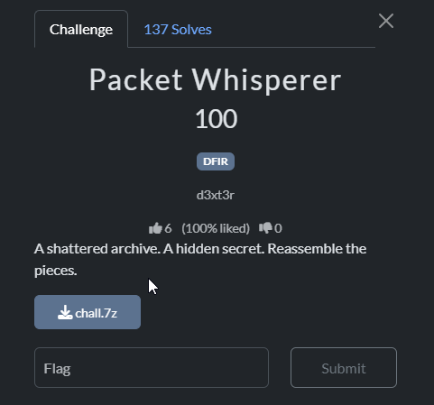
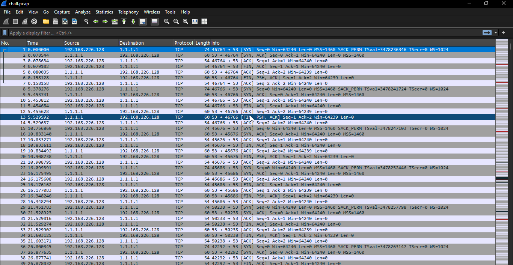
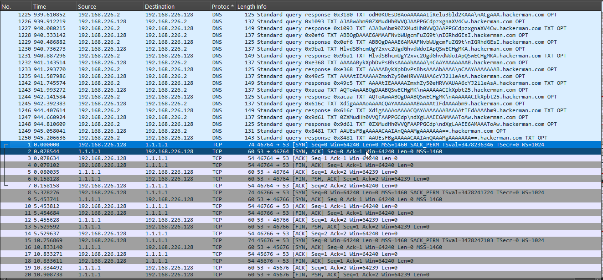
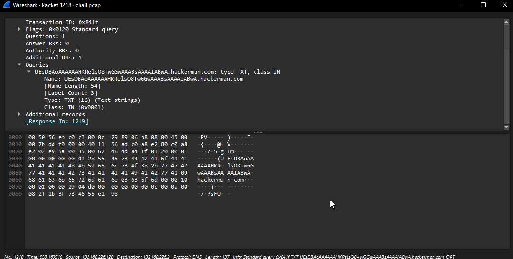
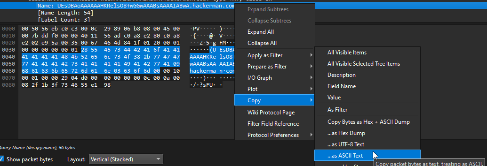
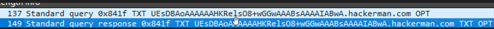
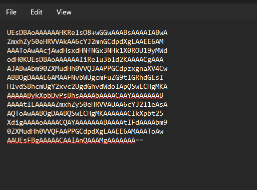
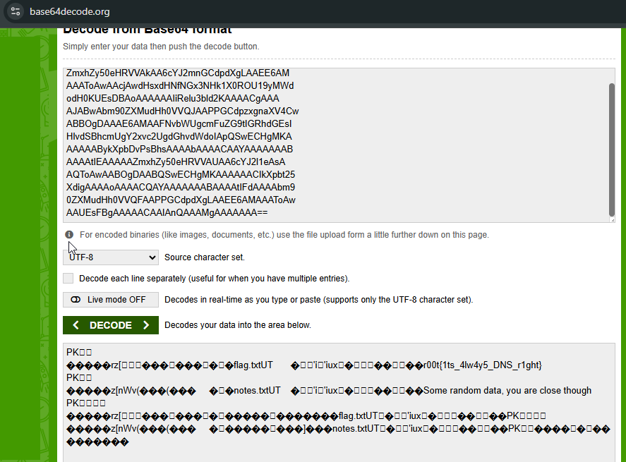
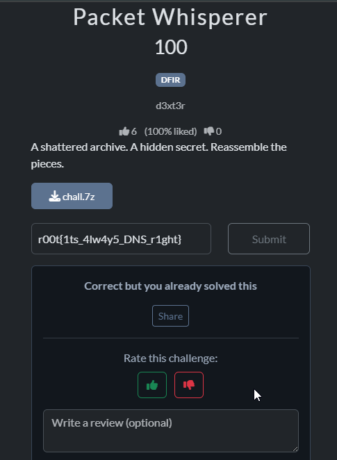

# Challenge Overview

> _A shattered archive. A hidden secret. Reassemble the pieces._

We are given a **pcap network capture** containing scattered fragments of what appears to be an archive. The challenge suggests that the "shattered" pieces must be reassembled to recover the secret.

# **Step 1 :Extract and Inspect the Provided Files**
After downloading and extracting the challenge ZIP, we find a single file:

- **chall.pcap** — a Wireshark packet capture

Open it in **Wireshark**.

# Step 2: Identify Relevant Traffic
In wireshark we see that there is only 2 protocols present ; TCP and DNS. Because DNS TXT records often carry hidden payloads in CTFs, we sort by protocol and focus on **DNS queries/responses**.

Each DNS TXT record contains suspicious Base64-looking strings. These are the “shattered” pieces(I say to myself) mentioned in the challenge prompt

# Step 3: Extract the Base64 Fragments and Verify 

Open the first entry and copy the base-64 encoded characters and verify its base-64

Make sure you copy as ASCII characters and not base-64 once you right click on it.

This is what i mean.

For example  for the first entry you'll get
     (UEsDBAoAAAAAAHKRelsO8+wGGwAAABsAAAAIABwA	hackermancom

Remove anything that is _not_ Base64 (e.g., parentheses, hostname).  
The cleaned base64 string becomes:
     UEsDBAoAAAAAAHKRelsO8+wGGwAAABsAAAAIABwA
Try to decode 

When decoded alone, it doesn’t produce anything readable — which is expected. The challenge explicitly states the archive is “shattered”, meaning **all fragments must be combined in order**.

# Step 4: Collect _All_ Base64 Strings
What to Do Now?

Repeat the extraction process for **every DNS TXT record**:

- Copy only the Base64 text
    
- **Do NOT include duplicates** -- For example look at the first two entries. You'll notice they have the same base-64 string. One is a response to the other. Ensure you only copy one(This will apply to all the records)

    
- **Preserve the order in which DNS records appear**  
This ordering is essential — the archive fragments must be concatenated exactly in the sequence they were transmitted.→ The best way is to follow the Wireshark packet _No._ column (top → bottom).

# Step 5: Reassemble and Decode

Once you are done saving each base-64 string to its own line on a txt file

Once all fragments are collected, copy the entire contents of your text file into any Base64 decoder.

# The flag🎉: r00t{1ts_4lw4y5_DNS_r1ght}

## *This challenge demonstrates a  DFIR technique: **data exfiltration via DNS tunneling**, with payloads “shattered” into multiple fragments.*

# **Thanks For Reading 🤩🤩**
